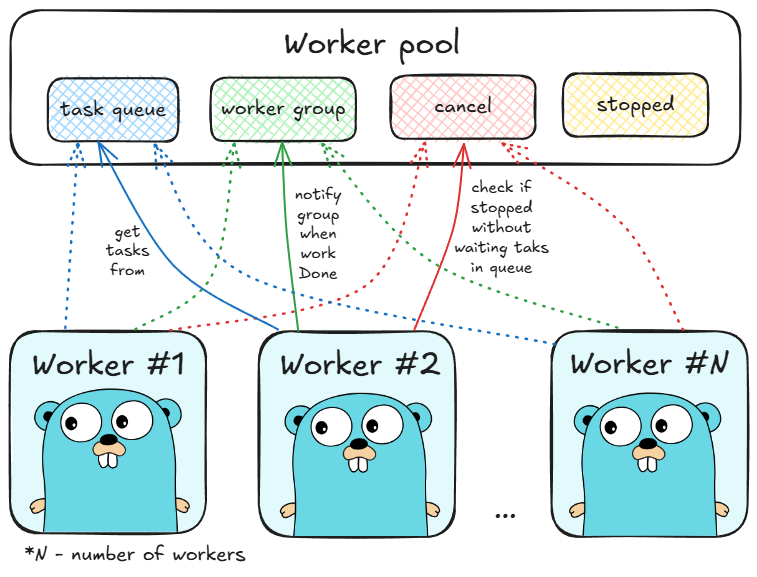

# Golang worker pool
В данном репозитории представлено решение тестового задания для прохождения на стажировку в компанию Kaspersky на направление "Go". 

## 0. Быстрый старт

1. Склонируйте репозиторий
```
git clone https://github.com/SmokingElk/golang-worker-pull.git
```
2. Создайте `.env` файл со следующим содержимым:
```
CONFIG_PATH="./config/config.yaml"
```
3. Запустите проект
```
make run
```

## 1. Постановка задачи

Необходимо реализовать WorkerPool и покрыть тестами.

```go
package worker_pool

type WorkerPool struct {
}

func NewWorkerPool(numberOfWorkers int) *WorkerPool {
	return &WorkerPool{}
}

// Submit - добавить таску в воркер пул
func (wp *WorkerPool) Submit(task func()) {

}

// SubmitWait - добавить таску в воркер пул и дождаться окончания ее выполнения
func (wp *WorkerPool) SubmitWait(task func()) {

}

// Stop - остановить воркер пул, дождаться выполнения только тех тасок, которые выполняются сейчас
func (wp *WorkerPool) Stop() {

}

// StopWait - остановить воркер пул, дождаться выполнения всех тасок, 
// даже тех, что не начали выполняться, но лежат в очереди
func (wp *WorkerPool) StopWait() {

}
```


## 2. Архитектура решения

На схеме ниже представлена архитектура решения:



Рассмотрим ее подробнее:
- `WorkerPool` в момент создания создает `N` воркеров (`N` - `numberOfWorkers`). Каждый воркер представляет из себя функцию, запущенную в отдельной горутине. 
- Воркеры получают задачи через `tasksQueue`, которая является каналом типа `Task`. Размер очереди определяется параметром `QueueSize`, который может быть передан в конфиге или установлен по умолчанию. 
- Для отслеживания завершения работы воркеров используется `workerGroup` - примитив синхронизации `sync.WaitGroup`. В момент создания воркера выполняется атомарный инкремент счетчика в группе, в момент завершения - атомарный декремент. Группа позволяет выполнить блокирующее ожидание значения 0 для счетчика. 
- Для завершения без выполнения всех задач используется тип данных `context.Context` с возможностью отмены. Вызов функции `cancel` приводит к закрытию канала `context.Done()`, который воркеры получают в момент запуска. 
- Потокобезопасный флаг `stopped` (реализован при помощи булевского флага и примитива синхронизации `sync.Mutex`) используется для защиты методов `WorkerPool` от вызова после остановки. Воркеры не взаимодействуют с этим флагом. 


## 3. Результат 

Полученная реализация `WorkerPool` реализует все методы, указанные в задаче. А также обладает рядом особенностей:
1. Имеется возможность создать `WorkerPool` с параметрами при помощи конструктора `NewWorkerPoolConfigured`. Конструктор ожидает контекст выполнения (см. пункт 2 текущего раздела) и указатель на объект конфигурации `WorkerPoolConfig`:
```go
wp := worker_pull.NewWorkerPoolConfigured(ctx, &worker_pool.WorkerPoolConfig{
	QueueSize:       256, // размер очереди задач
	NumberOfWorkers: 4, // количество воркеров
})
```
2. Добавлена возможность передать собственный контекст выполнения. Может использоваться для указания таймаута выполнения задач (см. раздел "Решение прикладной задачи").
3. Добавлен тип `Task` обеспечивающий автоматизированную проверку соответствия функции типу, который принимают методы `Submit` и `SubmitWait`. Данное решение удобно при определении функции задачи до ее добавления в пул. 
```go
var task worker_pool.Task = func () {
	// ...
}

worker_pool.Submit(task)
```
4. Добавлена защита от вызова методов `WorkerPool` после вызова одного из методов завершения. 

Модуль worker_pool покрыт тестами на 100%. 


## 4. Решение прикладной задачи

Рассмотрим решение прикладной задачи при помощи созданного типа данных. 

**Постановка:**

Пусть дан текстовый файл с логами сервиса заказов. Каждая строка в файле является записью следующего вида:
```json
{ "orderID": 1, "totalPrice": 1.0 }
```
Скорость обработки является критической (например, ее результаты могут отображаться на даш-борде владельца). Необходимо выполнить обработку файла и вычислить среднюю стоимость всех заказов. 

**Решени:**:

Решение задачи представлено в файле `cmd/app/main.go`. Рассмотрим его:

1. Добавим конфигурационный файл для быстрого изменения параметров воркера:
```yaml
logs_path: ./static/order-logs.txt
timeout_seconds: 2
worker: 
  queue_size: 256
  number_of_workers: 4
```
2. Создадим объект `WorkerPool`. Используем конструктор с конфигурацией для передачи параметров из конфига, а также добавления разумного ограничения на время выполнения:
```go
ctx, cancel := context.WithTimeout(context.Background(), time.Second*time.Duration(cfg.TimeoutSeconds))

wp := worker_pool.NewWorkerPoolConfigured(ctx, &worker_pool.WorkerPoolConfig{
	QueueSize:       cfg.Worker.QueueSize,
	NumberOfWorkers: cfg.Worker.NumberOfWorkers,
})
```
В случае истечения таймаута часть записей может оказаться необработана, однако в данной задаче время ожидания пользователя более критично. Будем исходить из предположения, что цена заказов распределяется равномерно и итоговая средняя величина будет слабо отличаться от фактической, в случае отбрасывания "хвоста" файла логов. 
3. Добавим задачи на обработку записей:
```go
sumMtx := sync.Mutex{}
totalSum := float32(0.0)
processedCount := 0

scanner := bufio.NewScanner(file)

for scanner.Scan() {
	logRecord := scanner.Bytes()

	var task worker_pool.Task = func() {
		var order OrderDTO

		err := json.Unmarshal(logRecord, &order)

		if err != nil {
			log.Println(fmt.Errorf("failed to parse order: %w", err))
		}

		sumMtx.Lock()
		defer sumMtx.Unlock()
		totalSum += order.TotalPrice
		processedCount++
	}

	wp.Submit(task)
}
```
Блокирующее суммирование и увеличение счетчика может пагубно влиять на производительность, но в данном случае значительно большее время уходит на парсинг записи, который будет выполнен асинхронно. 
4. Дождемся завершения выполнения задач, вычислим искомую величину и выведем результат:
```go
wp.StopWait()
cancel()

averagePrice := totalSum / float32(processedCount)

fmt.Printf("Average price of orders: %f", averagePrice)
```

## 5. Команды управления проектом

Ниже приведен список команд `Makefile` для управления проектом:
- `make run` - запустить проект
- `make build` - выполнить сборку проекта
- `make test` - запустить тесты
- `make test10` - запустить тесты 10 раз (обнаружение "мигающих тестов")
- `make cover` - вывести информацию о покрытии модуля `worker_pool` в браузер


## 6. Использованные инструменты

Модуль `worker_pool` реализован без использования сторонних библиотек. Lля тестирования и решения демонстрационной задачи используются несколько пакетов:
- `testify`- пакет, предоставляющий удобные assertions для тестов. [Репозиторий](github.com/stretchr/testify). 
- `godotenv` - легкая библиотека для загрузки файла переменных окружения. [Репозиторий](github.com/joho/godotenv).
- `cleanenv` - библиотека для продвинутого чтения файлов конфигурации. [Репозиторий](github.com/ilyakaznacheev/cleanenv)